# Workout Server

If you are getting started on this project We would recommend the following

## Create your folders

- Middleware
- Controllers
- Models

## Create files

- app.js
- db.js
- .env
- .gitignore

## Build As needed

- user controller
- log controller
- validate session

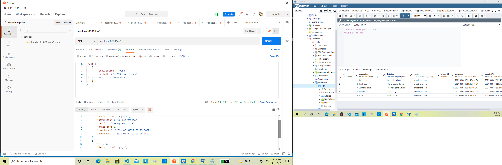
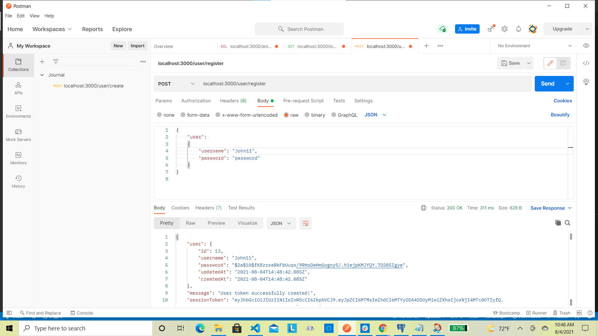
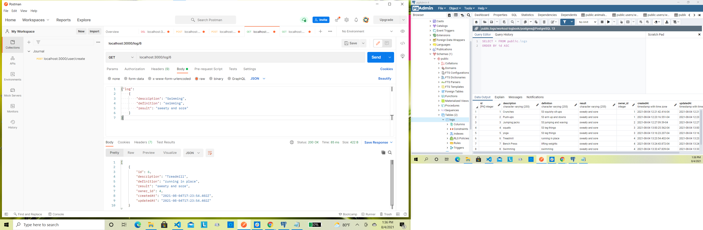
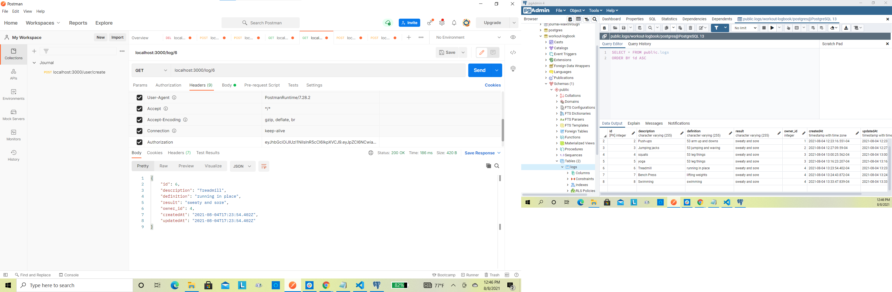
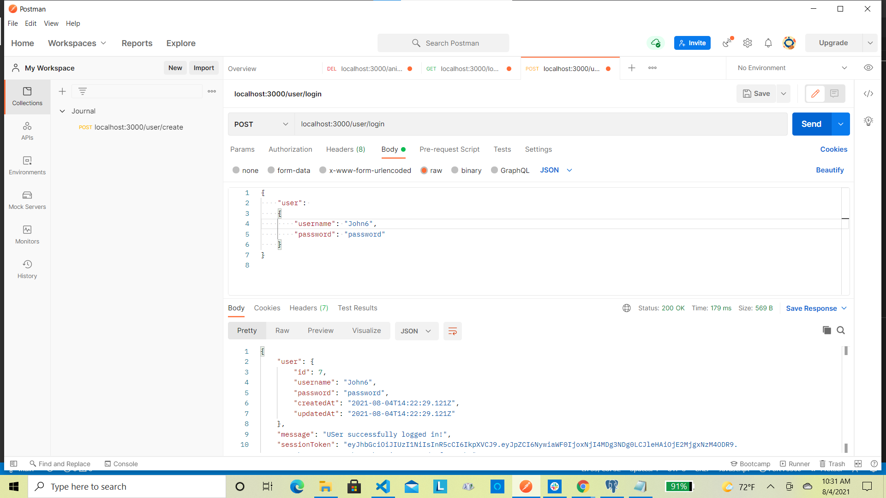
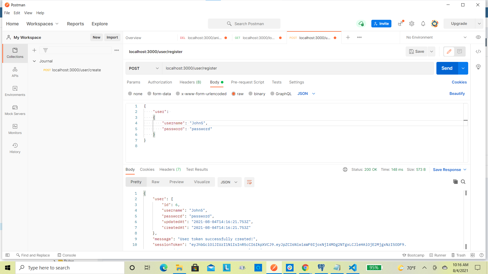
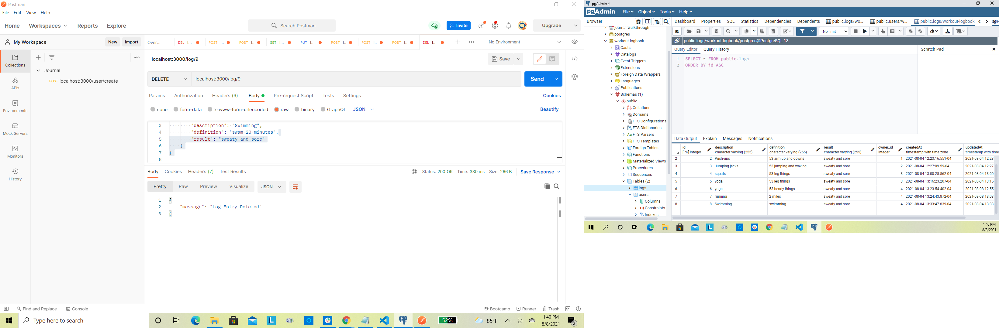
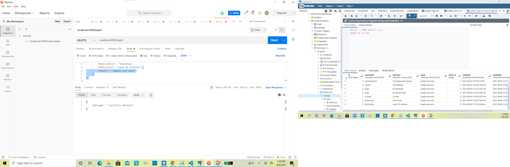
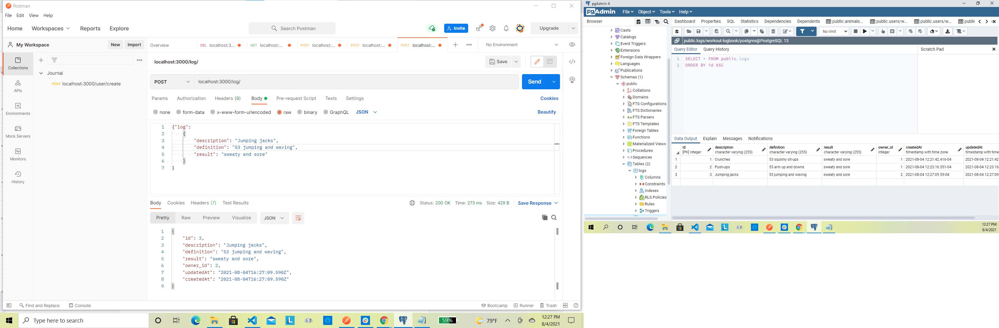
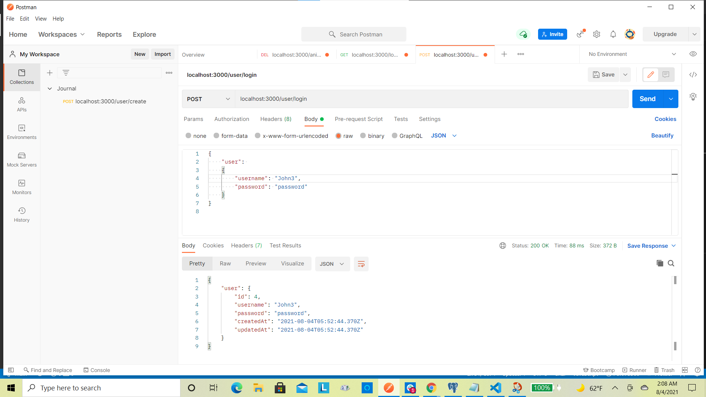
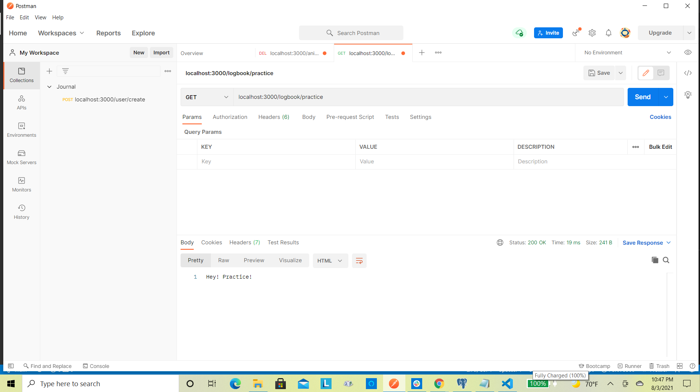
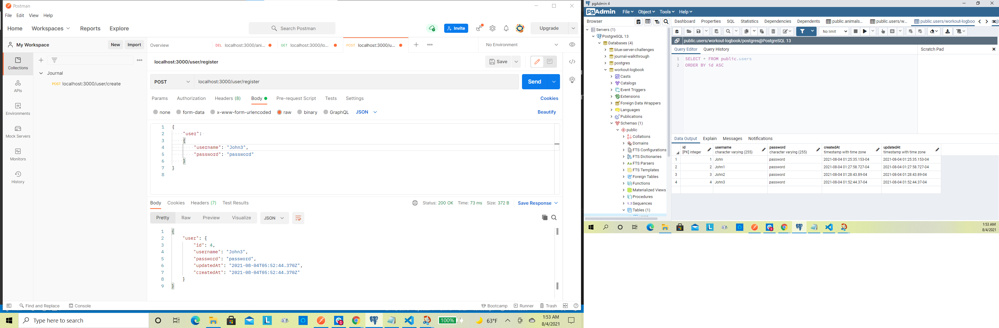
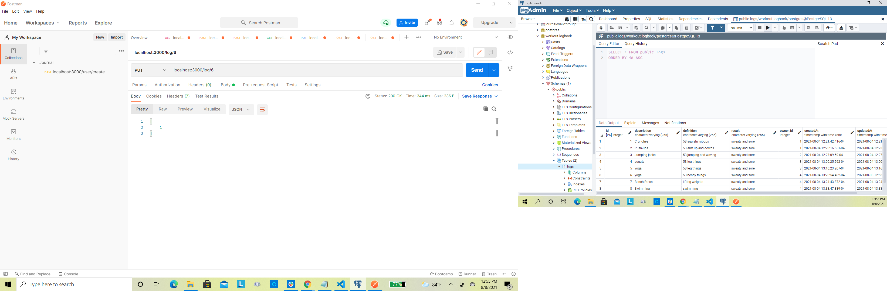

